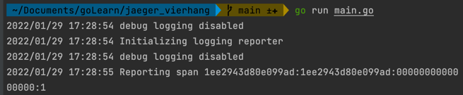
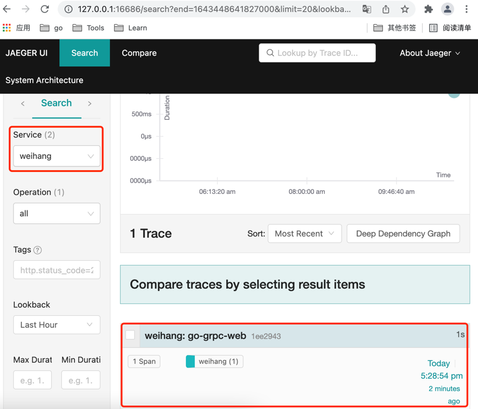

# jaeger_vierhang

## 安装jaeger
```bash
docker run \
  --rm \
  --name jaeger \
  -p6831:6831/udp \
  -p16686:16686 \
  jaegertracing/all-in-one:latest
```

执行go run example_one_span.go


进入jaeger后台
http://127.0.0.1:16686/search
可以看到，新增了一个服务："weihang"



## grpc 示例：
client目录
server目录
```bash
go run grpc_server.go
go run grpc_client.go
```  
试试即可